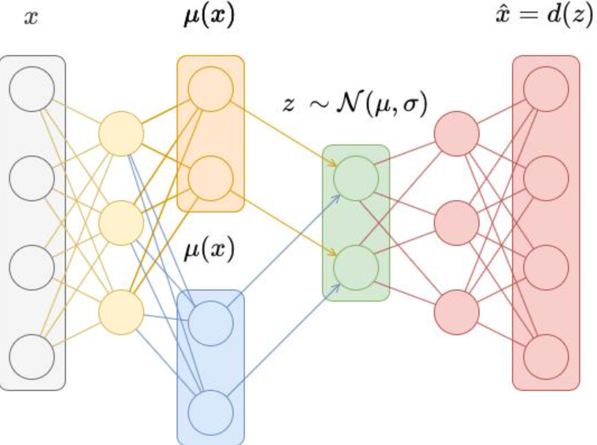
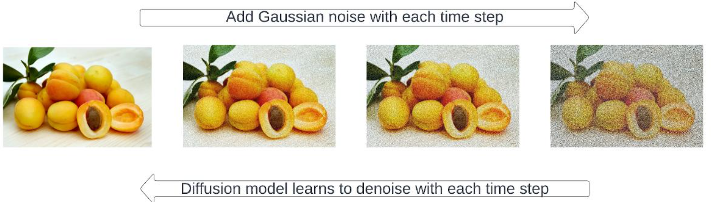

# blog-genai-cv

## Variational Autoencoders (VAE)

Variational Autoencoders (VAEs) are generative models designed to learn compact and meaningful representations of images. Rather than memorizing data, they capture the underlying structure of images, allowing them to generate new samples that resemble the original dataset.

A VAE is composed of two main components: an encoder and a decoder. The encoder compresses an input image into a simplified representation called a *latent space*, while the decoder reconstructs an image from this representation.

A helpful way to understand this process is to imagine storing objects inside a box. The encoder places the object into the box in a compact form, and the decoder retrieves and rebuilds it. However, the system does not store exact copies—it learns patterns. This enables the model to generate entirely new images by sampling from the latent space.

---

### Latent Representation and Reconstruction

The encoder transforms each image into a small vector—a kind of abstract fingerprint. Unlike standard autoencoders, the VAE introduces controlled randomness by representing each input as a distribution rather than a single point. This makes the latent space smooth and continuous.

As a result, it becomes possible to move gradually between different points in this space and obtain meaningful intermediate images. This property is particularly useful for generating variations and exploring the structure of the data.

### Strengths and Limitations

One of the main advantages of VAEs is their stability during training. They also provide a well-structured latent space that allows for controlled manipulation of image attributes such as lighting, pose, or expression.

However, this structured learning comes with a trade-off. Since VAEs optimize for average reconstruction accuracy, the generated images often appear slightly blurry and lack fine details compared to other generative models.

---

## Diffusion Models

Diffusion models represent one of the most advanced approaches in modern image generation. They are widely used in systems such as Stable Diffusion and other text-to-image models.

Their core idea is based on a gradual transformation between structure and noise. During training, noise is progressively added to an image until it becomes completely random. The model then learns how to reverse this process by removing noise step by step.

This process can be compared to revealing an image hidden under layers of dust. Instead of creating an image directly, the model starts from pure noise and progressively refines it until a coherent structure emerges.

### Guided Generation

A key innovation in diffusion models is their ability to incorporate external guidance, such as text prompts. During the denoising process, the model does not remove noise randomly—it follows a direction influenced by the input description.

For example, when given a prompt like *"an astronaut cat floating in space"*, the model uses this information at every step to guide the image toward a result that matches the description. This enables a high level of creative control and flexibility.

### Strengths and Limitations

Diffusion models are known for producing highly realistic and detailed images, with accurate textures and lighting. They are also more stable than GANs and capable of generating a wide variety of outputs.

However, these benefits come at a cost. The generation process is computationally expensive and relatively slow, as it requires many iterative steps to produce a single image. Optimizing this process remains an active area of research.

---

## Model Comparison: GAN vs VAE vs Diffusion

Generative models differ mainly in the way they approach image creation.

GANs rely on a competitive process between two networks, often producing very sharp and realistic images but suffering from unstable training. VAEs focus on structured representation and reconstruction, offering stability and interpretability at the expense of visual sharpness. Diffusion models generate images by progressively removing noise, achieving state-of-the-art quality while requiring significant computational resources.

| Model      | Core Idea                          | Advantages                          | Limitations                         |
|-----------|-----------------------------------|-------------------------------------|-------------------------------------|
| GAN       | Adversarial competition           | Highly realistic images             | Difficult and unstable training     |
| VAE       | Compression & reconstruction      | Stable, interpretable latent space  | Blurry outputs                      |
| Diffusion | Noise-to-image generation         | High-quality, diverse results       | Slow and computationally expensive  |

## Conclusion

Generative AI in computer vision has evolved significantly, offering multiple approaches to create realistic images. Each model follows a different philosophy.

VAEs focus on learning structured and continuous representations, making them reliable and easy to train, but they often lack visual sharpness. GANs introduce a competitive dynamic that can produce highly realistic images, although training them can be unstable. Diffusion models take a completely different path by generating images from noise, achieving impressive visual quality at the cost of computational efficiency.

Overall, these models highlight how different strategies can lead to similar goals: generating meaningful visual content. Among them, diffusion models currently stand out as the most powerful approach, especially in modern applications such as text-to-image generation.

Understanding these architectures provides a strong foundation for exploring more advanced topics in generative AI and computer vision.