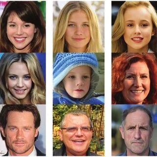
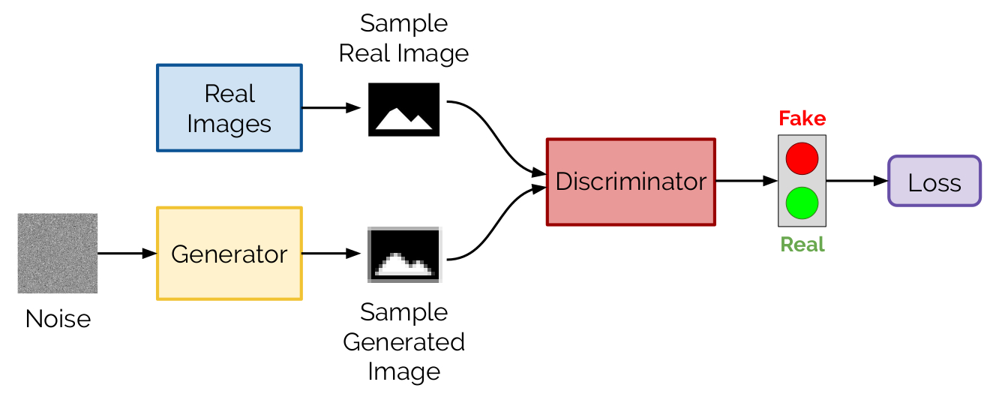

# Foundations of Generative AI in Computer Vision

> **Module 3 — Computer Vision & Deep Learning**  
> Academic course notes on Generative AI fundamentals, GAN architecture, and training dynamics.

---

## Table of Contents

- [What is Generative AI?](#what-is-generative-ai)
- [Examples of Generative AI](#examples-of-generative-ai)
- [Why Use Generative AI?](#why-use-generative-ai)
- [Generative Adversarial Networks (GANs)](#generative-adversarial-networks-gans)
  - [Core Concept](#core-concept)
  - [Intuitive Explanation](#intuitive-explanation)
  - [GAN Architecture](#gan-architecture)
  - [Training Workflow](#training-workflow)
  - [Mathematical Objective](#mathematical-objective)
- [Limitations of GANs](#limitations-of-gans)
- [Summary](#summary)
- [References](#references)

---

## What is Generative AI?

**Generative AI (GenAI)** in Computer Vision refers to a class of models capable of generating new visual data rather than simply analyzing or classifying existing images. Unlike traditional discriminative approaches that focus on **recognizing patterns**, generative models aim to learn the underlying probability distribution of the data and use it to synthesize new, realistic samples. This process can be intuitively understood through the analogy of an art student who studies thousands of paintings, internalizes their structures and styles, and eventually produces original artworks. In the same way, generative models learn from large datasets and create images that did not previously exist, marking a shift from passive perception to active content creation in computer vision.

> **Analogy — The Art Student**
> 
> Think of a student learning to paint:
> - They observe thousands of existing paintings
> - They internalize patterns, textures, styles, and structures
> - They then produce **entirely new works** that never existed before
>
> Generative AI works the same way: it **learns from data** and produces new, realistic content.

---

## Examples of Generative AI

| Application | Description | Model Type |
|---|---|---|
| AI-generated human faces | Photorealistic faces of non-existent people | StyleGAN, ProGAN |
| Image-to-image translation | Convert sketch → photo, day → night | Pix2Pix, CycleGAN |
| Super-resolution | Enhance low-res images to high-res | SRGAN, ESRGAN |
| Deepfake generation | Realistic face-swapping in video/images | DeepFaceLab, FaceSwap |
| Text-to-image synthesis | Generate images from text prompts | DALL·E, Stable Diffusion |



---

## Why Use Generative AI?

The adoption of Generative AI is driven by its ability to address key limitations in traditional computer vision systems while enabling new capabilities. One of its primary uses is data augmentation, where synthetic data is generated to compensate for limited or imbalanced datasets, particularly in domains such as medical imaging where data collection is costly or constrained. It also plays a crucial role in content creation, automating the generation of visual assets for industries such as gaming, film, and digital art, thereby reducing production time and costs. Furthermore, generative models are widely used in simulation environments, allowing systems like autonomous vehicles and robots to be trained in safe, controlled, and diverse virtual settings. In research and security, they contribute to testing model robustness and exploring adversarial scenarios, making them valuable tools for innovation and system validation.

### 1. Data Augmentation
Generating synthetic labeled data to supplement limited or expensive real datasets. Particularly useful in medical imaging, where annotated data is scarce.

### 2. Content Creation
Automating asset generation for video games, digital art, advertising, and entertainment industries — reducing production time and cost.

### 3. Simulation & Training Environments
Creating synthetic virtual environments to train models (e.g., autonomous driving, robotics) before real-world deployment. Provides controlled, diverse, and safe training data.

### 4. Research & Innovation
Applied in healthcare (generating MRI/CT scans), security (adversarial robustness testing), and scientific discovery (protein structure generation, material design).

---

## Generative Adversarial Networks (GANs)

Generative Adversarial Networks (GANs), introduced by **Ian Goodfellow** in 2014, represent one of the most influential architectures in generative modeling due to their unique adversarial training framework. A GAN consists of two neural networks—a Generator and a Discriminator—that are trained simultaneously in a competitive setting. The Generator learns to produce synthetic images from random noise, while the Discriminator evaluates whether a given image is real or generated. This adversarial interaction creates a dynamic learning process in which both networks continuously improve, leading to increasingly realistic outputs. GANs have become a foundational approach in image generation tasks and have significantly advanced the field of Generative AI.
### Core Concept

At the core of GANs lies the interaction between two competing components with opposing objectives. The Generator is responsible for mapping random noise vectors to synthetic images, effectively learning how to mimic the distribution of real data, while the Discriminator acts as a binary classifier that attempts to distinguish between real and generated images. These two networks are trained jointly, with the Generator trying to fool the Discriminator and the Discriminator striving to correctly identify fake samples. This competitive process forms the basis of adversarial learning and is what enables GANs to produce highly realistic data over time.

---

### Intuitive Explanation

Think of a GAN as a game between two agents:

| Agent | Analogy | Objective |
|---|---|---|
| Generator | A **forger** | Produce fake images so convincing that the detective cannot tell |
| Discriminator | A **detective** | Identify which images are fake and which are real |

Over time:
- The **forger** improves its technique → more realistic fakes
- The **detective** improves its analysis → better at spotting fakes

**Result:** After sufficient training, the generator produces images virtually indistinguishable from real ones.

---

### GAN Architecture
 


The architecture of a GAN is structured around the flow of data between the Generator and the Discriminator, forming a closed training loop. The process begins with a random noise vector sampled from a predefined distribution, which is then passed through the Generator to produce a synthetic image. This generated image, along with real images sampled from the training dataset, is fed into the Discriminator, which outputs a probability indicating whether each image is real or fake. The Generator and Discriminator are typically implemented as deep neural networks, often using convolutional layers for image data, and their interaction defines the overall behavior of the system. This architecture enables the model to iteratively refine its outputs through feedback from the Discriminator.

---

### Training Workflow

The training process of a GAN involves an iterative sequence of steps in which both the Generator and Discriminator are updated alternately. First, a batch of random noise vectors is sampled and passed through the Generator to produce synthetic images. These generated samples are then combined with real images from the dataset and evaluated by the Discriminator, which assigns probabilities indicating their authenticity. Based on these predictions, loss functions are computed for both networks: the Discriminator is optimized to correctly classify real and fake images, while the Generator is optimized to produce images that can deceive the Discriminator. Through repeated application of backpropagation and gradient-based optimization, both networks gradually improve until reaching a point where the Discriminator can no longer confidently distinguish between real and generated data.


---

### Mathematical Objective

The GAN training objective is a **minimax two-player game**:

$$\min_G \max_D \; V(D, G) = \mathbb{E}_{x \sim p_{data}}[\log D(x)] + \mathbb{E}_{z \sim p_z}[\log(1 - D(G(z)))]$$

**Interpretation of each term:**

| Term | Meaning |
|---|---|
| $\mathbb{E}_{x \sim p_{data}}[\log D(x)]$ | D should output 1 (real) for real images — maximized when D correctly identifies real data |
| $\mathbb{E}_{z \sim p_z}[\log(1 - D(G(z)))]$ | D should output 0 (fake) for generated images — maximized when D correctly rejects fakes |

**Each network's goal:**

```
Discriminator D  →  MAXIMIZE V(D, G)   (better classification)
Generator G      →  MINIMIZE V(D, G)   (fool the discriminator)
```

At Nash equilibrium, $p_G = p_{data}$ and $D(x) = \frac{1}{2}$ for all $x$.

---

## Limitations of GANs

Despite their power, GANs come with significant training challenges:

### Training Instability
The minimax game can diverge if G and D are not balanced. If D becomes too strong, G receives no useful gradient signal (vanishing gradients). If G becomes too strong, D collapses.

**Mitigation:** Use Wasserstein GAN (WGAN), gradient penalty (WGAN-GP), or spectral normalization.

### Mode Collapse
The generator learns to produce only a limited variety of outputs, ignoring the full diversity of the training distribution. G "cheats" by repeatedly producing the same few samples that fool D.

**Mitigation:** Mini-batch discrimination, unrolled GANs, or diversity-promoting losses.

### Hyperparameter Sensitivity
GANs are notoriously difficult to tune. Small changes in learning rate, batch size, or architecture can completely destabilize training.

**Mitigation:** Use established architectures (DCGAN, StyleGAN2) with validated hyperparameters as starting points.

> GANs are powerful but require careful architecture design and training strategies. These limitations motivated the development of newer generative models such as **Variational Autoencoders (VAEs)** and **Diffusion Models**.

---

## Summary

| Concept | Key Takeaway |
|---|---|
| **Generative AI** | Models that *create* new images, not just analyze existing ones |
| **GAN Framework** | Two-network adversarial game: Generator vs. Discriminator |
| **Training Objective** | Minimax game — G minimizes, D maximizes V(D, G) |
| **Nash Equilibrium** | Training converges when D(x) = 0.5 for all inputs |
| **Main Limitations** | Training instability, mode collapse, hyperparameter sensitivity |
| **Modern Successors** | Diffusion Models (DDPM, Stable Diffusion) now surpass GANs in image quality |

> Generative AI represents a fundamental shift in computer vision: machines are no longer just pattern recognizers — they are **creators**.

---

## References

- Goodfellow, I., et al. (2014). *Generative Adversarial Nets*. NeurIPS. [arXiv:1406.2661](https://arxiv.org/abs/1406.2661)
- Radford, A., et al. (2015). *Unsupervised Representation Learning with Deep Convolutional GANs*. [arXiv:1511.06434](https://arxiv.org/abs/1511.06434)
- Karras, T., et al. (2019). *A Style-Based Generator Architecture for GANs*. CVPR. [arXiv:1812.04948](https://arxiv.org/abs/1812.04948)
- Isola, P., et al. (2017). *Image-to-Image Translation with Conditional Adversarial Networks*. CVPR. [arXiv:1611.07004](https://arxiv.org/abs/1611.07004)
- Arjovsky, M., et al. (2017). *Wasserstein GAN*. ICML. [arXiv:1701.07875](https://arxiv.org/abs/1701.07875)

---

*Module 3 — Computer Vision · Generative AI Foundations*  
*Last updated: April 2026*
