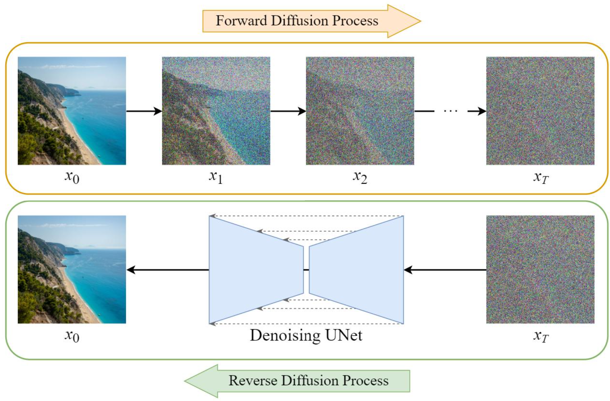

# blog-genai-cv

## Variational Autoencoders (VAE)

Variational autoencoders are generative models aimed at learning small but meaningful representations of the images. They do not just learn by heart but find patterns in the data, making it possible for the model to produce new images that look like the original dataset.

The variational autoencoder model consists of two parts: encoder and decoder. The first one represents an algorithm that reduces the original image to its simple form, known as a latent space. The decoder then uses this representation to recreate the picture.

A good analogy to this operation would be putting some items in a box. First, you pack all the items in the box in an easily stored manner. Next, you unpack them and use the stored information to create the image. The model does not store images as such but finds patterns that help it produce a completely new image.

---

### Latent Representation and Reconstruction

The encoder encodes every image into a short vector, which can be seen as an abstract fingerprint. The VAE differs from a regular autoencoder in the sense that it adds some randomness to the process by considering every image not as one fixed point but as a whole distribution.

Due to this approach, the latent space will have a continuous nature, allowing one to make a transition from one point in it to another and get an intermediate image.

### Strengths and Limitations

One of the key strengths of variational autoencoders (VAEs) is that they are very stable in training. Another important feature is that they generate a well-organized latent space in which attributes of images such as lightening, posture, or expression can be manipulated easily.

The drawback of the organized learning in VAEs is that they generally produce blurry images due to their optimization towards average reconstruction quality.

---

## Diffusion Models

The diffusion approach constitutes one of the most sophisticated techniques utilized in the field of current image generation. It is employed in various systems like Stable Diffusion or other text-to-image generators.

At its essence, this model relies on the principle of a continuous transition from structure to noise. Specifically, noise is incrementally added to an image until the latter becomes totally randomized. This process is then reversed through learning how to undo the previous addition of noise.

It can thus be seen that the mechanism works analogically to revealing an image covered with dust. In contrast to conventional techniques where the aim is to create an image, the diffusion approach works in the opposite way.

### Guided Generation

One of the main advancements in diffusion models is their capacity to include outside influence through means like prompting with text. In removing the noise, the diffusion process doesn't do so blindly but rather in a certain direction based on the prompt input.

For instance, if we prompt the model with *”an astronaut cat floating in space”,* the model uses this information throughout its iterations to produce an image matching the prompt.

### Strengths and Limitations

One of the advantages of diffusion models is that they can create high-quality images with very realistic textures and lighting. Moreover, diffusion models are quite stable compared to GANs and can generate many types of output.

Nevertheless, the disadvantages of this approach include the fact that it is quite computationally intensive. The process of creating an image takes a lot of time as a large number of iterations is needed to produce even one picture.

---

## Model Comparison: GAN vs VAE vs Diffusion

The main difference among generative models lies in their methodology for image generation.

GANs employ a process where the two networks compete against each other, resulting in high-resolution images that look real, albeit with training instability. VAEs concentrate on structured representation and image reconstruction, providing stability and interpretability while compromising on image resolution. Diffusion models involve the gradual elimination of noise to create images, ensuring top-notch resolution but demanding substantial computing power.

| Model      | Core Idea                          | Advantages                          | Limitations                         |
|-----------|-----------------------------------|-------------------------------------|-------------------------------------|
| GAN       | Adversarial competition           | Highly realistic images             | Difficult and unstable training     |
| VAE       | Compression & reconstruction      | Stable, interpretable latent space  | Blurry outputs                      |
| Diffusion | Noise-to-image generation         | High-quality, diverse results       | Slow and computationally expensive  |

## Conclusion

There have been many developments in the field of generative AI applied in computer vision with numerous techniques that generate realistic images. Each technique operates based on its own unique philosophy.

The Variational Autoencoder (VAE) architecture is concerned with creating continuous and structured representations, resulting in reliable and easily trainable models. However, it struggles in producing realistic images. Generative Adversarial Networks (GANs) incorporate a competition-based approach to generate realistic images but may require extensive training due to instability. Diffusion models are unique, as they operate by creating images from noise, and are known to generate extremely realistic images. 

In conclusion, all the above models showcase how various techniques can be used to achieve the same objective. Of the three models, the diffusion model currently stands out as the best technique for image generation, especially in the recent development of text-to-image synthesis.